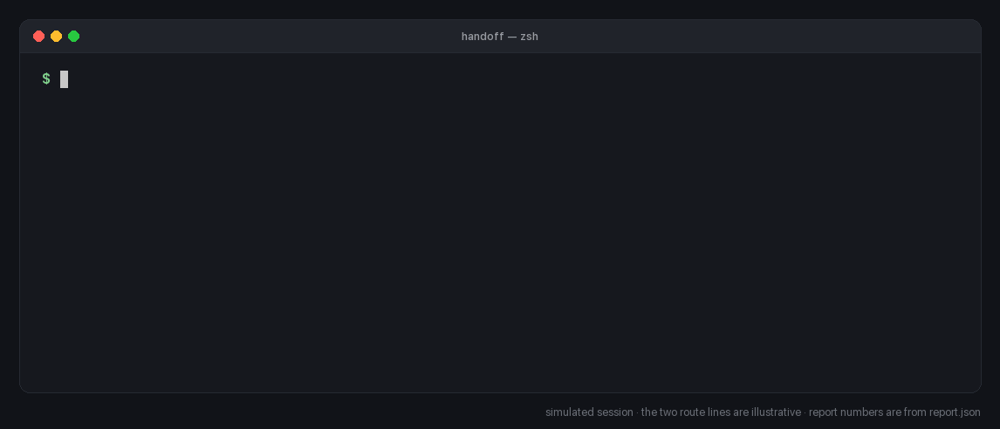
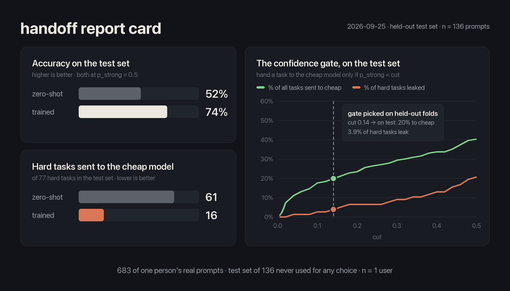

<div align="center">

# handoff

**Train a tiny router on your own AI chat history.**
It decides — locally, in about a tenth of a second — which of your requests a cheap model can handle
and which need the strong one. Built on [Laya](https://github.com/NandhaKishorM/laya).



[Quick start](#quick-start) · [Report card](#the-report-card) · [claude-code-router](#use-it-with-claude-code-router) · [How it works](#how-it-works) · [Honest limits](#honest-limits) · [Related projects](#related-projects)

</div>

---

Most routers guess what "hard" means from someone else's benchmark. You already have the best training data for
your own work: every request you've typed into Claude Code or Codex. handoff turns that history into a personal
router in about ten minutes, on a laptop, and tells you exactly how often it would get it wrong.

- **Learns from the history you already have.** No need to route traffic through a proxy for weeks first.
- **Your policy, your labels.** You write what "cheap" and "strong" mean in plain English; handoff labels your
  history against it (with your own `claude -p`, by hand, or from a CSV).
- **Honest report card.** A test set that is never used for any choice, a zero-shot baseline, and the number that
  matters most: how many *hard* tasks would slip to the cheap model.
- **A confidence gate.** It only hands off when it's very sure; everything uncertain stays strong.
- **Decision only, fails open.** It returns `cheap` or `strong` and never touches your API calls. If it's down,
  slow or unsure, the answer is `strong` — handoff can only save money, never break a request.
- **Small-Mac friendly.** The local service loads Laya on the first request and unloads it after 10 idle minutes,
  giving the ~3 GB back. It listens on 127.0.0.1 only and requires a secret token.
- **Private by default.** Everything lives in `~/.handoff` (0700). API keys, tokens and private keys are blanked
  out before anything is saved.

## Quick start

```bash
pipx install git+https://github.com/kingd2925-beep/handoff     # or: pip install git+https://…
handoff extract                     # your own messages from Claude Code history (--source codex, or --file)
handoff label                       # labels them with `claude -p --model haiku` against the default policy
handoff train                       # ~2 minutes: fits the router, prints the report card
handoff route "summarise these meeting notes into 5 bullets"
# {"route": "cheap", "p_strong": 0.01, "source": "trained", "ms": 61}
```

The first `route` call loads the model (~50 s); after that each decision takes ~0.05–0.4 s.
Edit the policy first if you like: `handoff label --policy my-policy.md` (start from
[`examples/policy.md`](examples/policy.md)). Prefer not to send anything anywhere? `handoff label --backend manual`
and press `c` / `s`.

| Command | What it does |
|---|---|
| `handoff extract [--source claude\|codex] [--file f]` | keeps only the messages you typed; assistant replies are never read into the dataset |
| `handoff label [--backend claude\|manual\|csv]` | labels cheap/strong; resumes where it stopped |
| `handoff train` · `handoff report` | trains the head and prints / re-prints the report card |
| `handoff route "…"` | one JSON line: `cheap` or `strong` (fails open to `strong`) |
| `handoff gate --cheap-share 0.3` | hand off more (or less) and see the leak it costs |
| `handoff ask '{"state": …, "questions": …}'` | any Laya question (choice / score / yes-no) through the same service |
| `handoff serve` · `status` · `stop` | run the service in the foreground, check it, stop it |

## The report card

These are the real numbers from the author's own history — **683 prompts, one person (n = 1)**. Yours will differ.



| On a test set of 136 prompts never used for any choice | zero-shot Laya | handoff (trained) |
|---|---|---|
| Accuracy | 52 % | **74 %** |
| Hard tasks sent to the cheap model (at 0.5) | 61 of 77 | **16 of 77** |
| With the confidence gate (default) | — | **20 % of tasks handed off, 3.9 % of hard tasks leak** |

Moving the gate is a trade-off you can see before you make it:

| `handoff gate --cheap-share` | handed to cheap (test) | hard tasks leaked (test) |
|---|---|---|
| default (leak ≤ 5 % on dev) | 20 % | 3.9 % |
| `0.2` | 23 % | 6.5 % |
| `0.3` | 29 % | 9.1 % |

"Accuracy" here means agreement with the labels — labels a model produced from a written policy, spot-checked by a
human — not verified task outcomes. Treat it as "how well it learned your policy".

## Use it with claude-code-router

[claude-code-router](https://github.com/musistudio/claude-code-router) can call a custom JavaScript router.
[`examples/claude-code-router/handoff-router.js`](examples/claude-code-router/handoff-router.js) asks handoff about the
latest user message and returns your cheap model only when handoff says `cheap`; otherwise it returns nothing and CCR's
own rules decide.

```jsonc
// ~/.claude-code-router/config.json
{ "CUSTOM_ROUTER_PATH": "~/.claude-code-router/handoff-router.js" }
```
```bash
export HANDOFF_CHEAP_MODEL="ollama,qwen3:8b"   # any "provider,model" you've configured in CCR
handoff route "warm up"                        # load the model once
```

Tested against the real service: *"summarise these meeting notes"* → `ollama,qwen3:8b` in 125 ms;
*"audit this contract clause for legal risk"* → left to CCR.

## How it works

```
your history ──extract──▶ your prompts ──label (policy)──▶ cheap / strong
                                              │
              Laya's frozen encoder ──embed───┘
                                              ▼
           logistic head  ◀── 5-fold CV (regularisation) on 80 % dev
                 │
                 ├── confidence gate ◀── out-of-fold predictions on dev (hard-task leak ≤ 5 %)
                 └── report card     ◀── 20 % test set, never used for any choice
```

- The encoder is [Laya](https://github.com/NandhaKishorM/laya)'s multilingual checkpoint (Apache-2.0, 322 M params,
  100+ languages — Hinglish works). Only a small head is trained, so it fits in seconds on an 8 GB Mac.
- The gate is the largest cut-off whose out-of-fold hard-task leak stays under 5 %. An earlier version chose it on a
  single 136-prompt validation split and swung between "hand off 15 %" and "hand off nothing" on almost the same
  data; out-of-fold predictions fixed that.
- The service: `127.0.0.1:7071`, token in `~/.handoff/token`, Host and Content-Type checked (no browser CSRF or DNS
  rebinding), model head loaded with `torch.load(weights_only=True)`.

## Honest limits

- **n = 1.** The numbers above are one person's history. Measure your own with `handoff train`.
- **Labels are model-made.** `claude -p` follows your policy well but not perfectly; spot-check a sample.
- **It's heavier than a rule.** ~3.1 GB RAM while loaded and a ~50 s cold start. Rules (like claude-code-router's)
  are instant; handoff is for when rules can't capture what "hard" means for you.
- **It is not a guardrail.** In a separate test, zero-shot Laya missed 6 of 10 dangerous shell commands. Never use
  handoff (or Laya zero-shot) to decide whether something is *safe*.
- Tested on macOS (Apple Silicon). Linux with CUDA or CPU should work but is untested. The history extractor knows
  Claude Code and Codex; anything else works through `--file`.

## Related projects

handoff stands on and next to great work — pick what fits:

| Project | What it is | How handoff differs |
|---|---|---|
| [Laya](https://github.com/NandhaKishorM/laya) | the fast local decision model handoff is built on; ships its own Jev-compatible server and a zero-shot router preset | handoff adds personal training from your history, the gate and the report card |
| [stuntd](https://github.com/bladedevoff/stuntd) | a local proxy that learns your app's typed decisions from live traffic with a Laya head | learns from traffic you route through it; handoff bootstraps from history you already have and never proxies |
| [claude-code-router](https://github.com/musistudio/claude-code-router) | routes Claude Code requests to other providers with rules | handoff plugs in as its custom router (above) |
| [RouteLLM](https://github.com/lm-sys/RouteLLM) | routers trained on public preference data, with cost-threshold calibration | handoff trains on *your* data; `gate --cheap-share` borrows its calibration idea |

## Privacy

`extract` reads your local history files and keeps only what you typed. `label --backend claude` sends those prompts to
your own Claude account through the `claude` CLI — the same place they came from. Nothing else leaves the machine. API
keys, tokens, JWTs, private keys and `password: …` values are replaced with `[redacted]` before anything is written.
Delete everything with `rm -rf ~/.handoff`.

## Development

```bash
git clone https://github.com/kingd2925-beep/handoff && cd handoff
pip install -e '.[test]' && pytest -q          # 205 tests, no model download needed
```

AI assistants: read [`AGENTS.md`](AGENTS.md) first.

## License

[MIT](LICENSE) © 2026 Aryan Gupta. Laya is Apache-2.0 — see [NOTICE](NOTICE).
